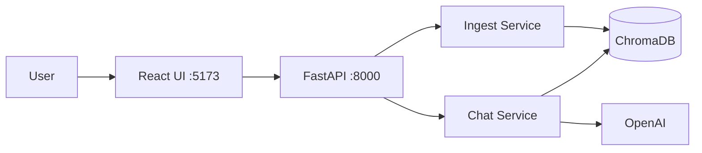

# SourceLogic SaaS (Multi-Tenant AI RAG)


Local-first RAG assistant for repository exploration. The system indexes source files into ChromaDB and serves grounded responses through a React UI and FastAPI backend.

## Stack

- Frontend: React + Vite + TypeScript
- Backend: FastAPI + SQLAlchemy (SQLite) + LangChain
- Retrieval Store: ChromaDB
- LLM: OpenAI via LangChain adapters

## Architecture Diagram



## Setup

### Backend (secrets only)

```powershell
cd Chat-Project\backend
python -m venv .venv
.\.venv\Scripts\Activate.ps1
pip install -r requirements.txt
Copy-Item .env.example .env
```

`backend/.env` must contain:

```env
OPENAI_API_KEY=your_openai_api_key
DATABASE_URL=sqlite+aiosqlite:///./data/codechat.db
CHROMA_PATH=./data/chroma_db
```

Run backend on port 8000 (from `Chat-Project` root):

```powershell
cd Chat-Project
python -m uvicorn backend.app.main:app --reload --host 0.0.0.0 --port 8000
```

### Frontend (public config only)

```powershell
cd Chat-Project\frontend
npm install
Copy-Item .env.example .env
```

`frontend/.env` must contain only:

```env
VITE_API_URL=http://localhost:8000
```

Run frontend on port 5173:

```powershell
cd Chat-Project\frontend
npm run dev -- --host 0.0.0.0 --port 5173
```

No root-level `.env` is used.

## API Contract (Real vs Planned)

| Endpoint | Method | Status | Notes |
| --- | --- | --- | --- |
| `/workspaces` | GET | Real | List registered workspaces |
| `/workspaces` | POST | Real | Register workspace root path |
| `/workspaces/{workspace_id}/status` | GET | Real | Workspace indexing status |
| `/workspaces/{workspace_id}/sessions` | POST | Real | Create chat session |
| `/sessions/{session_id}/history` | GET | Real | Retrieve chat history |
| `/workspaces/{workspace_id}/ingest` (`/ingest`) | POST | Real | Triggers background codebase ingestion to ChromaDB |
| `/chat/{session_id}/stream` (`/stream`) | POST | Real | Stateful streaming LLM response using DB-backed Chat Memory |

## Known Limitations

- Real authentication flow (OAuth2/JWT) is currently mocked via `X-Tenant-ID` header to demonstrate multi-tenant data isolation purely at the storage and logic layer.

## Features

- **Hybrid Architecture (Local RAG + OpenAI)**: Processes code embeddings locally with open-source models while selectively querying GPT-4o for complex reasoning.
- **SaaS-Grade Multi-Tenant Isolation**: Built with scalable Data Isolation principles, enforcing strictly separate contexts (`X-Tenant-ID`) across Workspaces, Sessions, and Vector Store chunks.
- **Agentic Polling & Streaming**: Real-time feedback via SSE (Server-Sent Events) for the chat and asynchronous background tasks for heavy ingests.

## Trade-offs

- `frontend/.env` is intentionally limited to public runtime config (`VITE_API_URL`) to avoid secret leakage in browser bundles.
- Secrets are kept in `backend/.env` for local development simplicity; enterprise deployments should move them to a managed secret store (Vault/KMS).

## Security Notice

- Critical To-Do: if any real `OPENAI_API_KEY` was ever committed or shared from the previous root `.env`, rotate it immediately.

## Project Structure

```text
backend/
  .env               # secrets (not committed)
  .env.example       # placeholders only
  app/
    api/v1/          # FastAPI routes
    core/            # config + database setup
    models/          # SQLAlchemy models
    schemas/         # Pydantic models
    services/        # RAG + ingestion + chat logic
frontend/
  .env               # public UI config only
  .env.example
  src/               # React application

## Credits

Developed and maintained by **Federico Orsi**.
```
