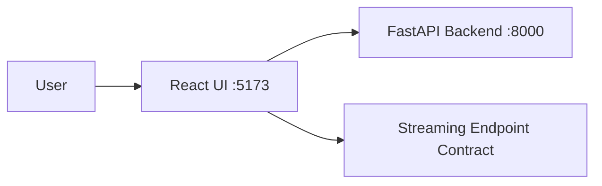

# Chat-Project Frontend


React + Vite frontend for the Chat-Project local-first RAG interface.

## Stack

- React 18
- Vite
- TypeScript
- Axios + Tailwind CSS

## Architecture Diagram



## Setup

```bash
npm install
cp .env.example .env
```

`frontend/.env` must contain only public variables:

```env
VITE_API_URL=http://localhost:8000
```

Run locally:

```bash
npm run dev -- --host 0.0.0.0 --port 5173
```

## API Contract (Real vs Planned)

| Endpoint | Status | Notes |
| --- | --- | --- |
| `GET /workspaces` | Real | Lists workspaces |
| `POST /workspaces` | Real | Creates workspace |
| `GET /workspaces/{workspace_id}/status` | Real | Polling for indexing status |
| `POST /workspaces/{workspace_id}/sessions` | Real | Creates session |
| `GET /sessions/{session_id}/history` | Real | Retrieves message history |
| `POST /workspaces/{workspace_id}/ingest` | Planned by frontend, not exposed by backend API | Backend ingest service exists but route is not mounted |
| `POST /chat/{session_id}/stream` | Planned by frontend, not exposed by backend API | Streaming behavior expected by UI but not exposed as API route |

## Known Limitations

- Ingest and streaming endpoints are expected by the UI but are not currently mounted in backend API routes.

## Trade-offs

- Frontend reads `VITE_API_URL` for API target portability across environments.
- No secrets are allowed in frontend env files because Vite exposes `VITE_*` values to browser bundles.
