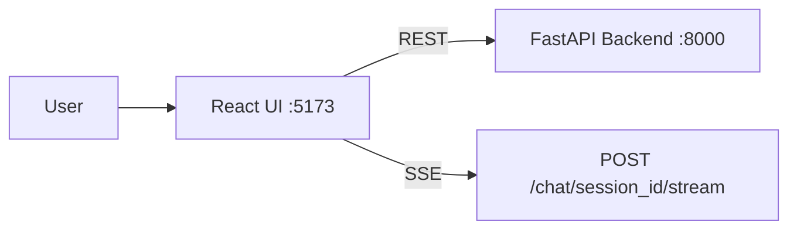

# SourceLogic Frontend


React + Vite frontend for the SourceLogic local-first RAG interface.

## Stack

- React 18 + TypeScript 5.6
- Vite 5
- TailwindCSS 3.4 + Framer Motion 11
- Axios 1.7 (REST) / native fetch (SSE streaming)

## Architecture Diagram


```mermaid
flowchart LR
    U[User] --> UI[React UI :5173]
    UI -->|REST| API[FastAPI Backend :8000]
    UI -->|SSE| Stream[POST /chat/session_id/stream]
```

## Setup

```bash
npm install
cp .env.example .env
```

`frontend/.env` must contain only public variables:

```env
VITE_API_URL=http://localhost:8000
```

Run locally:

```bash
npm run dev          # http://localhost:5173
```

## API Contract

All endpoints below are implemented and mounted in the backend.

| Endpoint | Status | Notes |
| --- | --- | --- |
| `GET /workspaces` | ✅ Live | Lists workspaces for current tenant |
| `POST /workspaces` | ✅ Live | Creates workspace (`name`, `root_path`) |
| `GET /workspaces/{id}/status` | ✅ Live | Polls indexing status (`IDLE` / `INDEXING` / `FAILED`) |
| `POST /workspaces/{id}/ingest` | ✅ Live | Triggers background ingestion, returns `task_id` |
| `GET /workspaces/ingest/{task_id}` | ✅ Live | Polls ingestion task progress |
| `DELETE /workspaces/{id}` | ✅ Live | Deletes workspace and all associated vectors |
| `POST /workspaces/{id}/sessions` | ✅ Live | Creates a chat session |
| `GET /workspaces/{id}/sessions` | ✅ Live | Lists sessions for a workspace |
| `DELETE /sessions/{id}` | ✅ Live | Deletes a session |
| `GET /sessions/{id}/history` | ✅ Live | Full message history (`limit` + `offset` supported) |
| `POST /chat/{session_id}/stream` | ✅ Live | Streams AI answer via SSE (citations + tokens) |

## Authentication

The frontend reads the active auth mode from the backend. In default `dev` mode, pass a tenant ID via header:

```
X-Tenant-ID: my-org
```

For `api_key` mode, set `X-API-Key` header. For `jwt` mode, set `Authorization: Bearer <token>`.
The `ChatHeader` component exposes a tenant selector for local development.

## Trade-offs

- `VITE_API_URL` makes the API target portable across environments without code changes.
- No secrets are allowed in frontend env files — Vite exposes `VITE_*` values to the browser bundle.
- SSE streaming uses native `fetch` (not Axios) to avoid response buffering.
